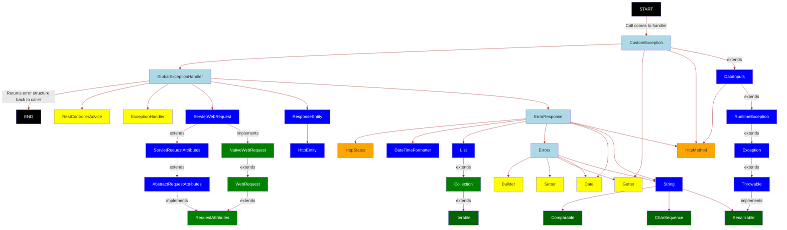

```mermaid
graph TD
    List:::InBuildInterface --> |extends| Collection
    Collection:::InBuildInterface --> |extends| Iterable:::MarkerInterface

    String:::InBuildJavaClass --> Comparable:::MarkerInterface
    String --> CharSequence:::MarkerInterface
    String --> Serializable

    ResponseEntity:::InBuildJavaClass --> HttpEntity:::InBuildJavaClass

    ServletWebRequest:::InBuildJavaClass --> |extends|ServletRequestAttributes
    ServletWebRequest --> |implements| NativeWebRequest
    ServletRequestAttributes:::InBuildJavaClass --> |extends| AbstractRequestAttributes
    AbstractRequestAttributes:::InBuildJavaClass --> |implements| RequestAttributes:::MarkerInterface
    NativeWebRequest:::InBuildInterface --> |extends| WebRequest
    WebRequest:::InBuildInterface --> |extends| RequestAttributes:::InBuildInterface

    RuntimeException:::InBuildJavaClass --> |extends|Exception
    Exception:::InBuildJavaClass --> |extends|Throwable
    Throwable:::InBuildJavaClass --> |implements|Serializable:::MarkerInterface
    
    START:::startend -->|Call comes to handler|CustomException 
    GlobalExceptionHandler --> |Returns error structure back to caller|END:::startend
    
    CustomException --> GlobalExceptionHandler
    CustomException:::UserDefinedJavaClass--> Getter:::annotation
    CustomException --> HttpMethod:::enum
    CustomException --> |extends|DataInputs

    DataInputs--> HttpMethod:::enum
    DataInputs:::InBuildJavaClass --> |extends|RuntimeException
    
    GlobalExceptionHandler:::UserDefinedJavaClass --> RestControllerAdvice:::annotation
    GlobalExceptionHandler --> ExceptionHandler:::annotation
    GlobalExceptionHandler --> ServletWebRequest
    GlobalExceptionHandler --> ResponseEntity
    GlobalExceptionHandler --> ErrorResponse
    
    
    ErrorResponse:::UserDefinedJavaClass --> HttpStatus:::enum 
    ErrorResponse --> DateTimeFormatter:::InBuildJavaClass
    ErrorResponse --> List:::InBuildJavaClass
    ErrorResponse --> Errors
    ErrorResponse --> Data:::annotation
    ErrorResponse --> String
    ErrorResponse --> HttpMethod:::enum
    
    Errors:::UserDefinedJavaClass --> Builder:::annotation
    Errors --> Setter:::annotation
    Errors --> Getter:::annotation
    Errors --> Data:::annotation
    Errors --> String

    classDef Interface fill: lightgreen;
    classDef InBuildInterface fill: green,color :white;
    classDef MarkerInterface fill: darkgreen,color :white;
    classDef UserDefinedJavaClass fill: lightblue;
    classDef InBuildJavaClass fill: blue,color :white;
    classDef annotation fill: yellow;
    classDef enum fill: orange;
    classDef startend fill: black, color :white;
    linkStyle default fill:none,stroke-width:1px,stroke:brown;

```